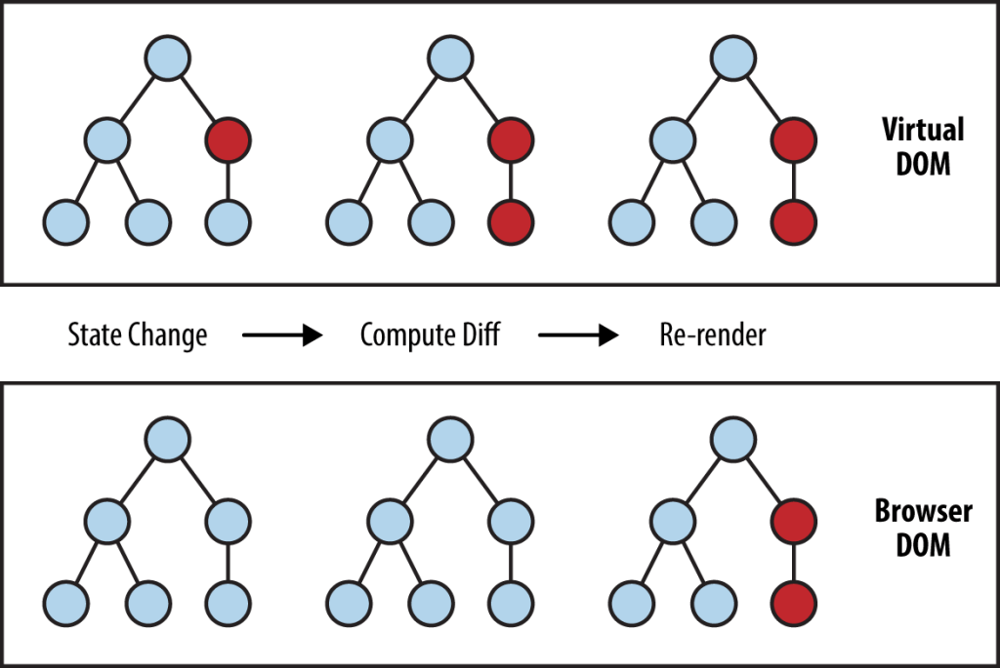

# Explanation of React

---

## What is React?

1. **React is a JavaScript library** used for building user interfaces, especially single-page applications.  
2. It allows developers to **create reusable UI components**, which makes development faster and more efficient.  
3. React uses a **virtual DOM** to update only the parts of the web page that change, improving performance.  
4. It follows a **component-based architecture**, making the code more organized and easier to maintain.  
5. React is widely used in modern web development by companies like Facebook, Instagram, and Netflix.  

### Real_Time Example :-
Suppose you are using an **E-commerce Website (like Amazon or Flipkart)**.  
- When you add a product to the **cart**, the cart count at the top updates instantly.  
- But the **entire page does not reload**.  
- This smooth and fast update happens because the website is built using **React**.  

---

## React என்றால் என்ன?

1. **React என்பது JavaScript library** ஆகும், இது இணையதளத்தின் User Interface (UI) உருவாக்க பயன்படுத்தப்படுகிறது.  
2. React மூலம் **மீண்டும் பயன்படுத்தக்கூடிய UI components** உருவாக்க முடியும், இதனால் வேகமாகவும் எளிதாகவும் development செய்யலாம்.  
3. இது **Virtual DOM** பயன்படுத்தி, மாற்றம் ஏற்பட்ட பகுதியை மட்டும் update செய்கிறது, இதனால் வேகமான செயல்திறன் கிடைக்கும்.  
4. **Component-based architecture** பின்பற்றுவதால், code சீராகவும் பராமரிக்க எளிதாகவும் இருக்கும்.  
5. Facebook, Instagram, Netflix போன்ற பெரிய நிறுவனங்கள் **React-ஐ அதிகமாக பயன்படுத்துகின்றன**.  

### உண்மையான உதாரணம் :-
நீங்கள் ஒரு **மின்னணு வணிக வலைத்தளத்தை (அமேசான் அல்லது பிளிப்கார்ட் போன்றவை)** பயன்படுத்துகிறீர்கள் என்று வைத்துக்கொள்வோம்.
- நீங்க ஒரு product-ஐ **cart-க்கு add பண்ணும்போது**, மேல இருக்குற cart count உடனடியாக update ஆகும்.  
- ஆனால் முழுப் பக்கமும் மீண்டும் **reload** ஆகாது.
- வலைத்தளம் **ரியாக்ட்** ஐப் பயன்படுத்தி உருவாக்கப்பட்டுள்ளதால் இந்த மென்மையான மற்றும் வேகமான புதுப்பிப்பு நிகழ்கிறது.

---

